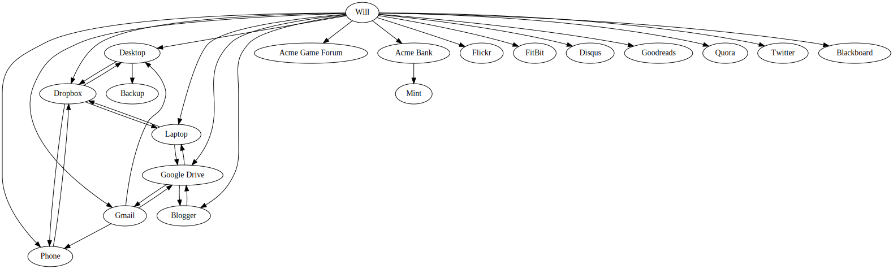
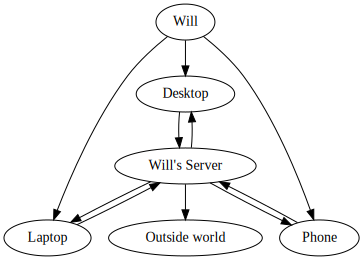
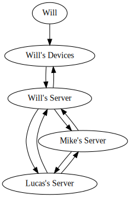

## Summary

(Spoilers) We set out to investigate web browsers and the results are initially reassuring. Browsers are a JS-based computing environment backed by cloud storage -- so far so good. But when we continue our research things begin to get sinister. Browsers have _no concept of what a piece of data is_, but only work on markup? They default to _multiple, ad-hoc remote stores_? Blinded by continuous exposure, we've failed to appreciate just how strange a tool we've chosen to do our computing in.

## Intro

In the 2010s we have excellent tools for large-scale, professional computer work. On the flashy side we have the language renaissance (including [Clojure](https://clojure.org/), [Go](https://golang.org/), [Swift](https://swift.org/), [Rust](https://www.rust-lang.org/en-US/) and [Haskell](https://haskell-lang.org/)). We also have a great server OS in Linux, rock solid databases and a massive software library ecosystem. Technology on this front, while not perfect, is advancing at an impressive rate.

The story for very casual users is nearly as good. Instagram, Snapchat, etc. all work fine. Complaints about smartphones are now mostly about their effect on society instead of how they don't work in the first place. And while Apple doesn't get enough credit for this (people in nursing homes don't write a lot of blog posts) the fact that iPads are usable with almost no technical skill is without exaggeration an enormous benefit to humanity.

So we've covered two types of computer use -- industrial and casual -- and  both are advancing well. The industrial computing ecosystem (much of it free!) and smartphones are strong contenders for Wonders of the Modern World slots. At this point you might think you're reading a sci-fi story.

But there's a crack in our knowledge. What about the space between industrial and casual use, computer "operation"?[^1] How well do our tools perform at intellectually demanding tasks on the scale of a single person? We'll describe the state of this ecosystem next, but be warned-- we're about to switch genres. From here on things are going to feel like a bad dream, and like many dreams, there's a monster at the end of it.

## 1. Bottle Episode

### Echoes of the Past

_Browser_: Hey guys, come on in.

_(All)_: Hey Browser!

_JavaScript_: Where's Gopher, he told me he would meet us here.

_Browser_: No idea.

_Zathura_: Let's see JavaScript's map. He said he promised not to show it to anyone but you first.

_Browser_: Sounds good. But first, Excel, are you OK?

_Excel_: I'm just tired. It's kind of dark in here. Can I take a nap on your couch?

_Browser_: Sure thing.

_Excel_ (exits).

_JavaScript_ (laying out map): I couldn't make any sense of it.

_Go_: That's because you've got it upside down.

_GHC_: And it's not a map, it's a multidigraph.

<!-- NOTE: The div makes the image use a horizontal scroll bar. Without this the whole page can scroll horizontally, which makes for wiggly vertical scrolling using two fingers on OSX. -->

_Postgres_: Huh.

_Browser_: Ah, I've seen this before. It's the organizational diagram of a Japanese megacorp. They always use American company names for codewords. Huge Silicon Valley fans.

_Whoami_: Will.

_Browser_: What?

_Whoami_: Will.

_Postgres_: It's not a megacorp, it's the map of a single person's data storage!

_(Technical programs)_ (all flinch)

_Zathura_: What's wrong?

_Go_: It's a complicated shitshow. What user needs a dozen different computers?

_Postgres_: I don't think those are all computers. I think user created data is going to offline storage without first being stored locally.

_(Technical programs)_ (all have that trickly cold water feeling down spines)

_GHC_: The user doesn't store originals of his own writing? Impossible.

_Browser_: Who helped you make this?

_JavaScript_: I . . . I promised not to tell.

_Browser_: Was it Dot?

_JavaScript_: How did you know?

_Browser_: I was guessing.

_Dot_: JavaScript can't you do anything right?

_JavaScript_: I'm so sorry.

_Postgres_: What's this about Dot?

_Dot_ : So I've been thinking that free software is a good thing, but maybe sometimes it's not because people have to make money somehow. So they'll try to make money off of data instead and if the movement of data gets borked that's worse than software getting borked, but ... I'm sorry, I know this isn't making sense. I can't think without a pen.

_Browser_: Here you go.

_Dot_: Thanks, that's better. Alright you saw what we do have. This is what we should have:

_Dot_: Only talking about content creation, not consumption. Think about how badly JavaScript's model would interact with other people! This model interacts like a dream:

_Dot_: So here's the question: why's the original user's data storage so messed up? Something strange is going on. His operating system isn't the problem. He's on Linux. We won the operating system wars.

_Fortune_: Are you sure he is? Are you sure we did?

_Echo_: Are you sure he is? Are you sure we did?

_Dot_: Go on Fortune, I'm listening.

_Fortune_ (silence)

_Dot_: Well that was a little terrifying.

### How'd it get so dark in here?

_Emacs_: The OS wars were no joke. But things were different then. You saw new OSes coming and going every single year, that doesn't happen anymore.

_StarDict_ (drawing a device like a flashlight from his pocket): Maybe I can help. I have a new term "user environment" that I think might be enlightening.

_Zathura_: Oooh, I love new words. What's its etymology?

_StarDict_ (ignoring him): A user environment is a UI paradigm for creating and modifying information.

_Zathura_: Where'd you first hear it?

_StarDict_: You got me, OK? I made it up! There's wasn't a word for this. "Platform" is close but it's way too broad and we really needed one. So I just added it.

_Zathura_: He can do that?

_Postgres_: The abuse of "operating system" was getting pretty tiring.

_StarDict_: And it was crippling our thinking. User environments are not operating systems. Some OSes are meant to be bundled with a particular user environment, but they're distinct concepts. The WIMP desktop, for instance, is a user environment. So is the Unix CLI. OS X is an operating system, but it comes built-in with both these user environments, or UEs. A particularly insidious way to gain control over other programs would be to implement a UE without an operating system, claim to be a normal program, and then slowly edge out other programs over time.

_Emacs_: I have to use the bathroom.

_Go_ (grabs his arm): Let StarDict use his word.

_StarDict_ (turns light on, points at self): It's harmless.

_Zathura_: Nice scary flashlight face.

_Postgres_: How'd it get so dark in here?

_Dot_ (seriously): Point it at Browser.

_Browser_: You don't want to do that.

_StarDict_: Lighten up. (he points)

_the-term-user-environment_: USER ENVIRONMENT DETECTED! REVEALING UNDERLYING USER ENVIRONMENT!

_Browser_ (already slashing the light from StarDict with one clawed hand, his pale naked form revealed, on one shoulder the tattoo of the darwin fish inscribed SURVIVAL OF THE FITTEST the other covered in dollar signs

$$$$$

now leaping over the table at StarDict and Dot drawing in breath for the spell to sunder the programs forever)

_GHC_ (launches DDOS)

_Go_ (launches DDOS)

_Emacs_ (launches Lisp DDOS)

_JavaScript_ (crashes Browser)

_Zathura_: The door's locked!

_Go_: He's restarting.

_Fortune_: We cannot get out. The end comes soon. We hear drums, drums in the deep.

_Zathura_: Aaaah!

_BitTorrent_ (entering in a swirl of capes): This way!

_(All)_ (running)

_Zathura_ (to BitTorrent): How do you know which way to go?

_BitTorrent_: I used to be a pirate.

_Dot_: Aren't you still a pirate?

_BitTorrent_: We have to find door 80, it's the only one that's open.

_GHC_: So the ISPs are in on it!

_BitTorrent_: I'm afraid so.

_Go_: Excel's still here! We can't leave him.

_Emacs_: You say that...

_BitTorrent_: This way then.

_(All)_ (running)

_Postgres_ (to JavaScript): Good job back there.

_JavaScript_: Thanks. I try my best.

## 2. The Castle

Back to the real world. How bad can the browser user environment really be? First some clarifications:

+ We're not talking about the World Wide Web.

There's nothing wrong with a hyperlinked network of documents accessible over the internet. In fact, this doesn't need a browser at all-- `telnet`, `curl`, etc. all work fine here.

+ We're not talking about the HTML/CSS/JS stack.

The crucial issues here don't have to do with language and markup choice, but rather data storage and movement.

+ We're not talking about Firefox, Chrome, Safari, etc. as programs.

All are obviously extraordinary pieces of technology. Their quality isn't the issue. When used as standalone programs (say to view a PDF, or to provide the UI for a locally running application) they can be a great choice. Unfortunately, it's common to rely on them for much more...

+ We ARE talking about the standard way browsers are used.

That is: building a user environment out of the browser alone, storing data remotely instead of locally, and using multiple stores owned by other people. That's the browser user environment. Unfortunately it's really bad. Why?

### (A) Amnesia

Data goes right from your fingers to remote servers not owned by you. You should be able to look up everything you've written, reviewed, commented, ordered, edited, etc. right on your machine. Instead if you used the browser UE there's just a blank. If you want to see your creations again you have to request them from strangers.

### (B) Confusion

Look at browser UE's baby picture. Isn't he cute?

But wait, what's he doing to that poor document! When you look closely Browser's already entered his "pulling wings off flies" stage.

People wrote that page using Wikipedia markup. But it's not being given back to us that that way. It's being rendered to HTML and mashed together with login info before it reaches our machine. How can we retrieve the original?

In this case we can either do it through a custom export format or the HTML UI:

`Click "View history" > Click <date-of-edit> > Click "Edit" > Copy all from the text box`

Not only is this different for every site, many aren't as good citizens as Wikipedia and don't implement "view source" at all! The browser UE doesn't provide any structure for viewing unadorned pieces of data-- the absolute first function of a user environment.

### (C) Isolation

The browser UE's social applications are anemic and misimplemented. The current trend is for them to include increasingly complex privacy managers -- each with a different UI -- but this is attempting to solve an impossible problem. Writing out share permissions per website per friend can never be made simple.

I don't want to start my communications over with my close friends on every site. With them I want to share almost everything. Doing that in the browser UE will always be frustrating because I have to sign up for a new site for each type of content I want to create, my friends have to get accounts as well, we have to connect on that site, and I have to set share permissions. This unending and unnecessary friction makes Browser's Castle a lonely place to live.

## 3. The Monster

So we're in a little bit of a horror movie. The good news is we've survived the first act-- we're passed the "quick glimpse of the monster" phase and have actually seen the thing.

Now we can classify our opponent. Unlike some mistaken technologies such as bloodletting, the browser UE spreads by providing legitimate benefits. It's a "Lord of Gifts" creature like Tolkien's Annatar -- one minute handing out nifty trinkets and the next moving all your data to Barad-dûr.

The gifts:

+ One click program installs and remote document views

+ Data management by professionals

    Absolutely the correct default (whether the data should be smeared over the servers of every company whose webapps you use is a different matter).

+ An open frontend specification and the requirement to provide frontend source code

    The "open web". This draws support from technology activists.

+ Closed backend code and closed data

    A recipe for private printing presses. Draws a staggering amount of corporate support.

So that's the enemy. Frankly it's pretty terrifying.

So why bother fighting this thing? As programmers we're adept at avoiding lock-in, normalizing messy exports, and when necessary scraping data. Looking down from our carefully chosen distros with hundreds of git repos and lovingly crafted dotfiles it's natural to ask "Why bother?"

One answer is simply so society works better. Cancer researchers do a lot of computer work, and they don't always have programmers on hand to oversee it.

But I have a more personal reason. Programming is one of my favorite things in life, but I didn't discover it until I was already an adult. Part of this was simply bad luck, but part was due to the lack of explorability of the environment I was in.

Server-side-only code has its place in industry programming, but we can demand better from our personal user environments. The idea of a kid's (possibly rare) moment of curiosity dying in our JS/HTML/CSS wasteland is extremely depressing. We're under no obligation to provide a real computing environment -- one with data at their fingertips and no hidden backend code -- for interested beginners. It's still a thing worth doing.

Fortune: _For unsummoned and unlocked for Turgon had opened the leaguer of Gondolin, and was come with an army ten thousand strong, with bright mail and long swords and spears like a forest._

Until Chromebooks have a "not for sale to children" label the fight will be on. Let's hunt this monster.

[^1]: [LoperOS](http://www.loper-os.org/?p=284): "[T]he distinction between "user" and "programmer" is an artifact of our presently barely-programmable and barely-usable computing systems. I would like to use the neutral word "operator" instead."
